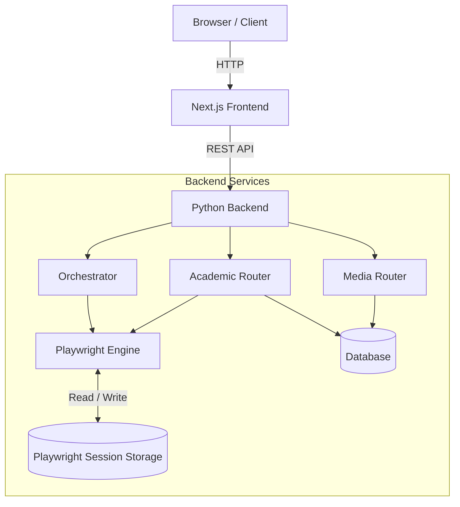

# ÆHub — AeSoul Digital Hub

# 📖 Overview

**ÆHub** is an advanced full-stack platform for orchestrating and automating interactions with academic portals. By leveraging a headless browser engine, the system enables extraction, synchronization, and management of university data and multimedia assets within a unified, centralized dashboard.

## 🎯 Project Purpose and Problem Solved

This project eliminates the fragmentation and repetitive nature of accessing academic information systems. AeSoul Hub automates login workflows and data retrieval processes while maintaining persistent browser sessions, ensuring fast responses and avoiding the typical bottlenecks of traditional web scraping approaches.

## 👥 Target Audience

* Students and researchers who need to monitor their academic status.
* Developers interested in scalable browser automation patterns.

---

## ✨ Features

* **Headless Academic Automation:** Automated login, logout, and academic status retrieval using Playwright.
* **Session Persistence:** Advanced management of browser cache, cookies, and local storage (`playwright_session/`) enabling instant access without re-authentication.
* **Task Orchestration:** Dedicated module (`orchestrator.py`) for coordinating complex operations and asynchronous workflows.
* **Media Management:** Upload, download, and processing of multimedia assets (`media.py`).
* **Responsive Interface:** Modern frontend built with Next.js (App Router).
* **Containerized Infrastructure:** Reproducible deployment using Docker and Docker Compose.

---

## 🏗 Architecture

The architecture follows a **decoupled client-server pattern**. The frontend acts as a presentation layer and API proxy, while the backend handles business logic, browser orchestration, and data access.




---


# 📂 Project Structure

The repository is organized as a **monorepo**, with a clear separation between frontend and backend components.

```text
aesoul-hub/
├── backend/                 # Python backend
│   ├── routers/             # API controllers
│   │   ├── academic.py      # Academic data management
│   │   ├── media.py         # File and asset processing
│   │   └── orchestrator.py  # Workflow and queue management
│   ├── playwright_session/  # Persistent browser profile storage
│   ├── database.py          # ORM and database connection
│   ├── main.py              # Application entry point
│   ├── pyproject.toml       # Python dependencies
│   └── dockerfile           # Backend container image
│
├── frontend/                # Next.js frontend
│   ├── src/app/             # App Router and API Routes
│   ├── public/              # Static assets
│   ├── components.json      # UI configuration
│   ├── next.config.js       # Next.js configuration
│   ├── package.json         # Node.js dependencies
│   └── dockerfile           # Frontend container image
│
└── docker-compose.yaml      # Stack orchestration
```

---

# 💻 Technologies Used

| Category   | Technology              | Purpose                                      |
| ---------- | ----------------------- | -------------------------------------------- |
| Frontend   | Next.js (React)         | User interface, SSR, and API proxy           |
| Backend    | Python (FastAPI*)       | REST APIs, business logic, and orchestration |
| Automation | Playwright              | Browser automation and web scraping          |
| Database   | SQLite / PostgreSQL     | Data persistence and logging                 |
| DevOps     | Docker & Docker Compose | Containerization and deployment              |

> *FastAPI inferred from the presence of `routers/` and `main.py`.

---

# ⚙️ Requirements

### Supported Operating Systems

* Linux (Ubuntu/Debian recommended)
* macOS
* Windows (preferably via WSL2)

### Required Software

* Docker 24.0+
* Docker Compose 2.0+

---

# 🚀 Installation

## 1. Clone the Repository

```bash
git clone https://github.com/your-org/aesoul-hub.git
cd aesoul-hub
```

## 2. Environment Configuration

Create the required `.env` files following the examples provided in the documentation.

## 3. Start with Docker

```bash
docker-compose up --build -d
```

## 4. Verify Services

### Frontend

```text
http://localhost:3000
```

### Backend API

```text
http://localhost:8000
```

---

# 🛠 Configuration

Environment variables control the application's behavior.

| Variable            | Description                       | Required | Example                          |
| ------------------- | --------------------------------- | -------- | -------------------------------- |
| DATABASE_URL        | Database connection string        | ✅        | postgresql://user@db:5432/aesoul |
| PLAYWRIGHT_HEADLESS | Runs the browser in headless mode | ❌        | true                             |
| API_SECRET_KEY      | JWT token secret key              | ✅        | super-secret-token               |
| NEXT_PUBLIC_API_URL | Backend URL used by the frontend  | ✅        | http://localhost:8000            |

---

# 🔌 API Reference

## Academic Authentication

### POST `/api/academic/login`

Starts an authenticated session using Playwright.

#### Payload

```json
{
  "username": "student_id",
  "password": "password"
}
```

#### Purpose

* Performs automated authentication
* Saves the browser session

---

### POST `/api/academic/logout`

#### Purpose

* Invalidates the current session
* Removes persistent cookies and session data

---

### GET `/api/academic/status`

#### Response

```json
{
  "status": "active",
  "grades": []
}
```

#### Purpose

Retrieves the user's current academic status.

---

# 🗄 Database

Persistence management is centralized in:

```text
backend/database.py
```

## Inferred Schema

### Users

Stores:

* User identifiers
* Preferences
* Authentication information

### MediaAssets

Tracks:

* Uploaded files
* Processing operations
* Associated metadata

### SyncLogs

Records:

* Synchronization events
* Automation execution results
* Errors and operational logs

---

# 🧪 Testing

A structured testing suite is currently not available.

## Recommendations

### Unit Testing

Use:

```text
pytest
```

to validate:

* Routers
* Services
* Business logic

### End-to-End Testing

Use:

```text
Playwright Test
```

to validate:

* React user interface
* Authentication workflows
* Scraping and automation processes

---

# 📦 Deployment

The project is already prepared for containerized environments.

## Production Best Practices

### Persistent Sessions

Ensure that:

```text
backend/playwright_session/
```

is mounted as a persistent volume and excluded from Git version control.

### Reverse Proxy

Configure:

* NGINX
* Traefik

for:

* HTTPS
* Load balancing
* Security

### Headless Mode

Set:

```env
PLAYWRIGHT_HEADLESS=true
```

in server environments.

---

# 🛡 Security

## Session Isolation

The directory:

```text
playwright_session/
```

contains:

* Cookies
* Tokens
* Temporary credentials

Access should be restricted at the filesystem level.

### Secret Management

Never store:

* Academic credentials
* Tokens
* API keys

inside the repository.

### Secure Communications

Always use:

```text
HTTPS/TLS
```

between:

* Frontend
* Backend
* Academic portals

---

# 📈 Performance and Scalability

## Current Optimizations

Caching Playwright data in:

```text
playwright_session/Default/
```

reduces:

* Repeated logins
* Static resource loading
* Response times

## Limitations

Each Playwright browser instance consumes a significant amount of RAM.

### Recommended Evolution

Implement:

* Redis
* Celery
* Dedicated workers

to distribute workloads managed by:

```text
orchestrator.py
```

---

# 🚨 Troubleshooting

## Issue: Academic Login Timeout

### Possible Causes

* CAPTCHA introduced by the target portal
* Changes to the target DOM structure

### Solution

Run with:

```env
PLAYWRIGHT_HEADLESS=false
```

and perform visual debugging of the automation process.

Also check logs located in:

```text
playwright_session/Default/LOG
```

---

## Issue: Database Locked

### Possible Cause

High concurrency on SQLite.

### Solution

Migrate to PostgreSQL by updating the configuration in:

```text
backend/database.py
```

---
# 🗺 Roadmap

* [ ] Add email/push notification system for academic updates.
* [ ] Create an administrative dashboard for automation monitoring.
* [ ] Implement observability with Prometheus and Grafana.

---

# 📄 License

**To be defined.**

Possible options:

* MIT
* Apache 2.0
* GPL v3
* Proprietary

---

# 📊 Current Project Status

| Area              | Assessment        |
| ----------------- | ----------------- |
| Architecture      | Good              |
| Code Organization | Good              |
| Security          | Needs Improvement |
| Testing           | Insufficient      |
| Scalability       | Moderate          |
| Deployment        | Good              |
| Observability     | Limited           |
| Overall Maturity  | 70/100            |

## Immediate Priorities

1. Implement an automated testing suite.
2. Migrate to PostgreSQL for concurrent environments.
3. Introduce secure secret management.
4. Add centralized monitoring and logging.
5. Implement asynchronous queues for Playwright.
